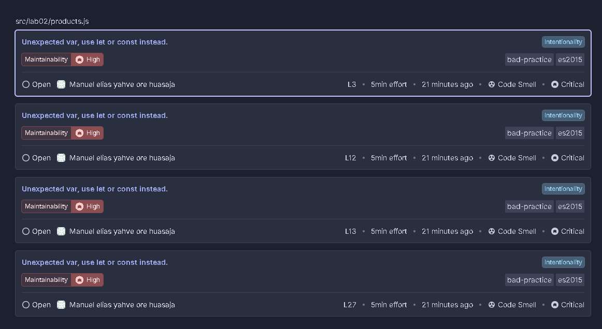
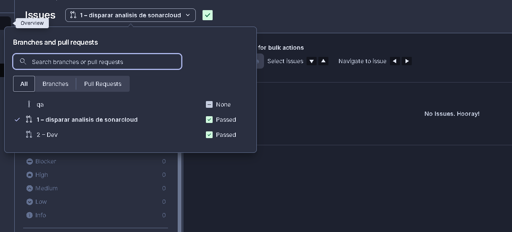

# Informe de Revisión Estática

## Datos del equipo
| Campo | Valor |
| :--- | :--- |
| Integrante 1 | Manu |
| Fecha | 11 de Mayo de 2026 |
| Laboratorio | Laboratorio 02 |
| Módulo revisado | `src/lab02/products.js` |
| URL SonarCloud | [https://sonarcloud.io/summary/overall?id=manu-cracks_LAB3_GUIA2&pullRequest=1] |

## Herramientas utilizadas
* ESLint 8.x con reglas: eqeqeq, no-var, no-unused-vars, prefer-const
* SonarCloud análisis automático conectado con GitHub
* Checklist manual (8 criterios)

## Resumen de hallazgos
| Herramienta | Archivo | Línea | Descripción | Severidad | Estado |
| :--- | :--- | :--- | :--- | :--- | :--- |
| ESLint | products.js | 14 | Comparación `==` en lugar de `===` | Alta | Corregido |
| ESLint | products.js | 4,12,22 | Uso de `var`, usar `const`/`let` | Media | Corregido |
| Manual | products.js | 2-8 | Precios negativos y nulos en datos | Alta | Corregido |
| Manual | products.js | 28 | `calculateDiscount` sin validación | Alta | Corregido |

## Captura del Quality Gate en SonarCloud
## captura sonar cloud antes de corregir el error

## Captura sonar cloud despues de corregir el codigo

## Propuesta de mejora
1. Agregar validación en `calculateDiscount`: `if (!product || product.price == null || product.price < 0)`
2. Migrar `var` a `const`/`let` en todo el módulo.
3. Agregar JSDoc a las tres funciones exportadas.
4. Crear `products.test.js` en la Semana 5.

## Conclusión del equipo
> ESLint es excelente para detectar errores de sintaxis y malas prácticas como el uso de `var` y `==`, pero no detecta errores de lógica de negocio. SonarCloud nos dio una visión más amplia de la calidad del código, pero fue la revisión manual la que nos permitió corregir los precios negativos y las validaciones nulas que las herramientas automáticas pasaron por alto.

## Enlace al Documento Monográfico (Word)
[PEGA_AQUÍ_TU_ENLACE_DE_GOOGLE_DRIVE]